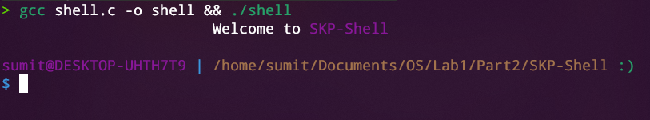
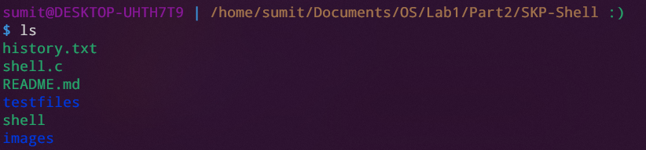
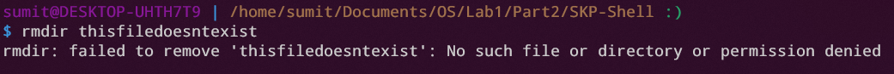
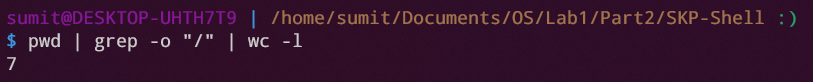

# SKP - A unix based shell written in C

### SKP is a Linux BASH like shell written in C. It implements all shell commands and supports pipelining. It also supports foreground and background processes

## Requirements

1. `gcc` compiler to run C program.
2. `unix` based OS/Environment

## How to Run?

1. Compile `shell.c` file using `gcc shell.c -o shell` command to compile.
2. Run `./shell` to execute the shell.

## Features of the shell

1. Many commands are inbuilt which are explained in the following section. All the other commands which are to be executed in foreground are implemented using `execvp`. So, all the commands available in Bash can be executed in SKP.

2. The prompt for taking the next command displays the `username`, `hostname` and the `present working directory`.

3. SKP provides option to run processes in background by appeding `&` to the end of your command.

4. Piping is provided and handled manually from scratch.

5. `STATUS` (success or failure) of the previous command is displayed along the prompt for the next command. <kbd>:)</kbd> of green color denotes success and <kbd>:(</kbd> of red color denotes failure.
6. SKP provides colorful display giving it a modern look. It also display different color for directories and files when `ls` command is executed.

## Inbuilt Commands

1. `clear` 

    - Clears the screen of the shell.

2. `pwd`  
    - Prints the current working directory.
    - Uses the `getcwd()` system call.

3. `cd [location]`  

    - Changes the current working directory to the mentioned directory.
    - Implemented using `chdir()` system call.

4. `ls [-l] [Directory]`  

    - Lists all the files and directories in the mentioned directory/directories. If no parameters are passed, lists the contents of current directory.
    - `-l` flag lists the long format of `ls`, providing additional details such as permissions, owner, time of creation etc.
    - The flags and directories can be provided in any order.
    - The output is color coded to distinguish between directories and files.
    - Uses the `opendir()` and `readdir` system call

6. `history [num]`  

    - Gives the `num` number of previous commands run. If `num` is not mentioned, prints entire history of commands.
    - The content is stored in history.txt. It is created when shell is started if it's not existing already.
7. `env`
    - Lists all environment variables present in the current session of the shell.
    
8. `mkdir <path>/directoryname`
    - Creates a new empty directory in the `path` given with the specified name.
    - Throws error if folder with same name already exist in that path.
    - Implemented using `mkdir()` system call.
9. `rmdir <path>/directoryname`
    - Removes the directory in the `path` given with the specified name.
    - Throws error if directory with the specified name doesn't exist in that path.
    - Implemented using `rmdir()` system call.
15. `exit`
    - Quits the terminal.
    - Use this command to ensure proper closing (killing all persisting background processes).
    - <kbd>Ctrl</kbd> + <kbd>D</kbd> provides the same functionality.
    - If the first command is `exit`, all other arguments are ignored and shell is killed.

## Executional Details

1.  Any command ending with `&` is treated as a background process the shell does not wait for its execution. If such a process requests terminal control, it will automatically suspended in the background. The shell keeps track of all background processes and alerts the user on their completion.

2.  <kbd>|</kbd> is used for piping of commands, i.e, `stdout` of one command serves as `stdin` for the next.  
    Example:
    `pwd | grep -o "/" | wc -l`

3.  <kbd>Ctrl</kbd> + <kbd>D</kbd> is an `EOF` character and terminates the shell.

## Implementation Details

-   `piping`  
    Contains the implementation of piping using `pipe` system call and `dup` system call.

-   `background`  
    Implementation of background processes indentified by `&`. Creates a new child process using `fork()` and the shell does not wait for its completion.

-   `trim`  
    Trailing and leading whitespaces are trimmed from the commands. The quotes are also removed from the commands.

-   `history.txt`  
    This file contains all previously executed command. The file is opened in `read` and `append` mode to read from and write to it respectively. This ensures that history is preserved across sessions.

### To Do

1. Arrow keys for command-recall
2. <kbd>Tab</kbd> for auto completion
3. `stdout/stdin/stderr redirection` using `<`and `>`.
4. Support multiple commands separted by `:`;
5. Chaining of commands using logical operators like `AND`, `OR`,etc. 
6. Aliasing  

## References
- [Code Vault YT Playlist](https://www.youtube.com/playlist?list=PLfqABt5AS4FkW5mOn2Tn9ZZLLDwA3kZUY)
- StackOverflow - for helping in fixing every error I got.
- [Linux Man Page](https://man7.org/linux/man-pages/man1/man.1.html)

## Screenshots
- Start Screen

- ls command with color coding

- Error handling

- Piping (counts number of '/')

